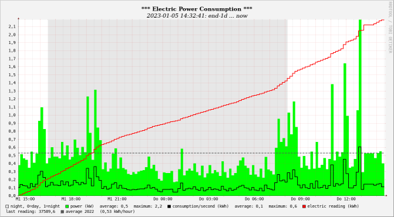

<!-- use sgmlproc for generating a html file -->

[](https://github.com/piet66-peb?tab=repositories)
[](https://oss.oetiker.ch/rrdtool/)

# RRDTool_API

is an HTTP API and a web-based user interface for round-robin databases 
created with RRDtool.

[RRDtool website](https://oss.oetiker.ch/rrdtool/)

[Alex van den Bogaerdt's RRDtool Tutorial](https://oss.oetiker.ch/rrdtool/tut/rrdtutorial.en.html)

[RRDtool Beginner's Guide](https://oss.oetiker.ch/rrdtool/tut/rrd-beginners.en.html)

## Features

It provides the ability to remotely
* store data in a database (rrdupdate)
* retrieve data from a database (rrdfetch)
* create, update and display graphs (rrdgraph)
* select data from a database using an SQL like command
* call user defined web pages containing graphs

## Usage

Display the main page and the interface description with
[**http://&lt;rrd_server&gt;:5001/**](html/img/RRDTool_API_interface.png)

## Requirements

RRDTool_API runs on all operating systems with Python 3 and RRDtool.
However, all included scripts are Linux bash scripts.
<br>The operation is done via web browser. For correct formatting of the output
a JSON Viewer Plugin and a Markdown Viewer Plugin are necessary.

## Installation

The included installation scripts are written for a Debian-based Linux with 
systemd, such as Raspberry Pi OS and Ubuntu.    
For other operating systems, the commands need to be adapted accordingly.

#### Proceeding

* Put the API packet on any place on the rrd server. 
* Run script **00_install_flask_rrdtool.bash**
* Run script **01_install_RRDTool_API.bash**
* Adjust the settings in the **./settings.py** file to your requirements and restart the API.

## Settings

Important settings (file **./settings.py**):
* username and password
* read/write permissions
* default graph size
* path to the rrd database files

## Start - Stop

* Start API with command **sudo systemctl start RRDTool_API**.
* Stop API with command **sudo systemctl stop RRDTool_API**.

## Uninstallation

* Run script **99_do_removes.bash**.
* Delete packet folder. With this action all included database and graph files 
are deleted as well.

You can also delete the software mentioned in **00_install_flask_rrdtool.bash**, 
if no other program is using it.

## User Defined Contents

#### Database Files

RRDTool_API expects the database files in the **./rrd** subfolder. 
You can change the default folder using **./settings.py**.
Please use links if your files are stored in multiple locations. 
All database files must have the extension **.rrd**.

#### Filling the Databases

Storing data into a database can easily be done using an HTTP command. 
<br>For example, with Curl:

```
curl -sS -X POST -u $USERNAME:$PASSWORD \
     http://$IP:$PORT/$RRD_NAME/update"?ts=$TIMESTAMP&values=$VALUE1:$VALUE2:..."
```

#### Graphs

In order for the API to create and update graphs, graph definitions
 must be created and stored in the **./graphs_def** folder. All definition files 
have a **.def** extension.
The generated graphs are stored in the **./graphs_img** folder.



RDDTool_API provides the possibility to generate default graph definitions from
 a database file. These can then be further developed manually.


#### User Web Pages

The **./html** folder can be used to store user web pages to be called by 
the API. Please note that RRDTool_API doesn't support all features of common 
web servers. It is mainly designed to display pages with generated graphs.

#### Examples of Custom Content

Instead of a huge manual, I have included some examples covering the most interesting cases:

* In the folder **rrd/**: some create scripts and xml dumps.
* In the folder **html/**: an index.html and some webpages calling graphs in different ways.
* In the folder **graphs_def/**: some graph definition files.
* In the folder **html/cgi-bin/**: an example for running rrdcgi. I don't recommend
this, but it is possible :smirk:.

Installation and Usage:

1. Restore all rrd-files with the shell script **restore_all_rrd_from_xml.bash**
   in the folder **rrb/**.
2. Generate the necessary default graph definitions for all rrd files via UI with 
   the command **/new_graph_definition?db=<...>**.
3. Run the example pages via **/html/index.html**.

When you don't need them any more, you should remove them from the standard folders.


#### Additional Resources

[RRDtool advanced Topics](https://tobi.oetiker.ch/ouce2013/)

[RRDtool Wizard](http://rrdwizard.appspot.com/index.php)

[RRD Calculator](https://eccentric.one/misc/rrdcalc.html)

## Third Party Processing

The API provides a SQL-like select command. This allows remote software or 
those without their own RRDtool interface to process stored data. 
Example: Grafana with JSON API.
<br>Example with Curl:

```
curl -sSN -o - -u  $USERNAME:$PASSWORD \
     http://$IP:$PORT/sql  \
     --get --data-urlencode "=select * from $RRD_NAME where ts > $FIRST and ts <= $LAST"
```

## Public Use

The RRDTool_API has a built-in web server. It is safe to use in a trusted 
environment. So far it is not intended to be used in public. It is also not 
investigated what that would entail.
More information on this topic can be found at 
https://flask.palletsprojects.com/en/2.2.x/deploying/.

## License: MIT

Copyright © 2022 piet66

Permission is hereby granted, free of charge, to any person obtaining a copy 
of this software and associated documentation files (the "Software"), to deal 
in the Software without restriction, including without limitation the rights 
to use, copy, modify, merge, publish, distribute, sublicense, and/or sell 
copies of the Software, and to permit persons to whom the Software is furnished 
to do so, subject to the following conditions:

The above copyright notice and this permission notice shall be included in all 
copies or substantial portions of the Software.

THE SOFTWARE IS PROVIDED "AS IS", WITHOUT WARRANTY OF ANY KIND, EXPRESS OR 
IMPLIED, INCLUDING BUT NOT LIMITED TO THE WARRANTIES OF MERCHANTABILITY, 
FITNESS FOR A PARTICULAR PURPOSE AND NONINFRINGEMENT. IN NO EVENT SHALL 
THE AUTHORS OR COPYRIGHT HOLDERS BE LIABLE FOR ANY CLAIM, DAMAGES OR OTHER 
LIABILITY, WHETHER IN AN ACTION OF CONTRACT, TORT OR OTHERWISE, ARISING FROM, 
OUT OF OR IN CONNECTION WITH THE SOFTWARE OR THE USE OR OTHER DEALINGS IN THE 
SOFTWARE.

